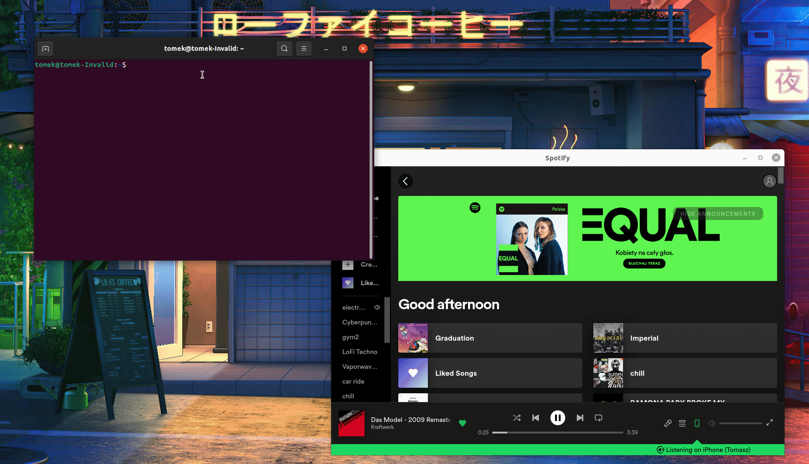

# Bashify

Simple command line interface for Spotify


## Installation

```
  # Clone the repository
  git clone https://github.com/KappaPrajd/bashify.git

  # Install dependencies
  sudo apt-get install dbus curl jq

  # Add bashify to PATH (optional)
  cd bashify
  sudo cp ./bashify.sh /usr/local/bin/bashify
```
    
## Usage

```
Usage: bashify [help] [play] [pause] [skip]
Options:
  play [song] - Resume playing or play a song if passed
  pause - Pause playing
  skip - Play the next queued song
  help - Print this help
```


## Demo


